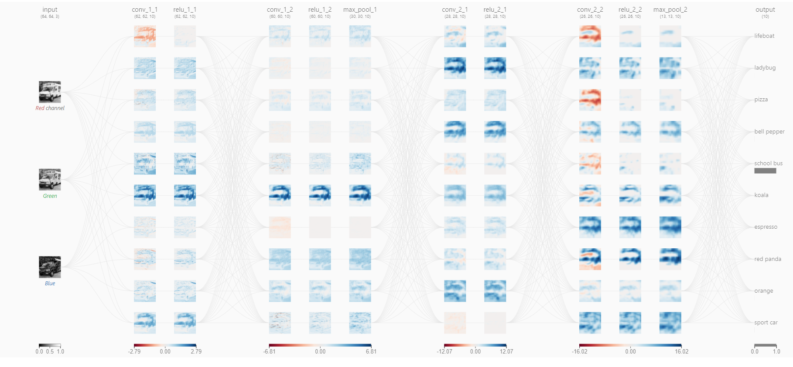

# 1. What are Channels and Kernels (according to EVA)?

  * Channel is a collection of contextually similar information placed together. Another interpretation of channel is a collection of similar or same feature. Sometime, a channel is also referred to as a feature map. Few examples of channels are -
    
    * All alphanumeric characters can be considered as separate channels (A-Z, a-z, 0-9, punctuations, other special characters, etc).
    * Different parts of speech can be considered as separate channels (Nouns can be considered as one channel, verbs as another and so on).
    * Mammals can be considered as a single channel in Animal Kingdom.
    * Each note in a song can be thought of as a different channel.
    * In a painting, all the shades of red can be considered a channel.

  * Kernel or Filter is a feature extractor. A kernel is a matrix of randomly initialized numbers whose output is a specific feature map such as vertical edges or horizontal edges, etc. The numbers in the matrix are called weights which are learned during backpropagation. Usually a 3 X 3 kernel is used.

  

# 2. Why should we (nearly) always use 3x3 kernels?

With 3 X 3 kernel size there are numerous advantages. Hence it is mostly used. Some of the advantages of using 3 X 3 filters are:

   * 3 X 3 kernel have lesser number of weights to learn, i.e., 9 weights per kernel. Hence it is computationally inexpensive. 
   * Since they are small, the features extracted are highly local and hence it an capture smaller and complex features from an image.
   * It requires lesser number of convolutions as compared to a more smaller kernel like 1 X 1 kernel. Another drawback of 1 X 1 kernel is that feature extracted is very local with no consideration to the neighbouring pixels.
   * 3 X 3 is an odd numbered kernel. Hence the output pixel will be always symmetrical to the input pixel. Hence we don't have to account for any distortions in the image.

# 3. How many times to we need to perform 3x3 convolutions operations to reach close to 1x1 from 199x199 (type each layer output like 199x199 > 197x197...)

    199 X 199
    197 X 197
    195 X 195
    193 X 193
    191 X 191
    189 X 189
    187 X 187
    185 X 185
    183 X 183
    181 X 181
    179 X 179
    177 X 177
    175 X 175
    173 X 173
    171 X 171
    169 X 169
    167 X 167
    165 X 165
    163 X 163
    161 X 161
    159 X 159
    157 X 157
    155 X 155
    153 X 153
    151 X 151
    149 X 149
    147 X 147
    145 X 145
    143 X 143
    141 X 141
    139 X 139
    137 X 137
    135 X 135
    133 X 133
    131 X 131
    129 X 129
    127 X 127
    125 X 125
    123 X 123
    121 X 121
    119 X 119
    117 X 117
    115 X 115
    113 X 113
    111 X 111
    109 X 109
    107 X 107
    105 X 105
    103 X 103
    101 X 101
    99 X 99
    97 X 97
    95 X 95
    93 X 93
    91 X 91
    89 X 89
    87 X 87
    85 X 85
    83 X 83
    81 X 81
    79 X 79
    77 X 77
    75 X 75
    73 X 73
    71 X 71
    69 X 69
    67 X 67
    65 X 65
    63 X 63
    61 X 61
    59 X 59
    57 X 57
    55 X 55
    53 X 53
    51 X 51
    49 X 49
    47 X 47
    45 X 45
    43 X 43
    41 X 41
    39 X 39
    37 X 37
    35 X 35
    33 X 33
    31 X 31
    29 X 29
    27 X 27
    25 X 25
    23 X 23
    21 X 21
    19 X 19
    17 X 17
    15 X 15
    13 X 13
    11 X 11
    9 X 9
    7 X 7
    5 X 5
    3 X 3
    1 X 1
Hence we need to perform 99 times 3 X 3 convolutions to reach 1 X 1 from 199 X 199.

# 4. How are kernels initialized?

Kernels are initialized to random numbers between 0 and 1. These weights are later learned during backpropagation. If we initialize all values to zero the output after a convolution operation will be zero and if we initialize all values to 1, the output after a convolution operation will be a cropped image, hence no feature will be learned. Therefore we initialize the weights of the Kernel between 0 and 1. The numbers are between 0 and 1 and not very large numbers to save memory.

    #Random initialization of a 3 X 3 kernel.
    k = np.random.rand(3,3).astype('float16')
    print(k)

    Output: [[0.117  0.5493 0.4578]
            [0.857  0.649  0.3655]
            [0.4087 0.3171 0.6694]]

# 5. What happens during the training of a DNN?

Each DNN has 4 blocks. At first block it learns about smaller and simpler features like edges and gradients. The edges and gradients are combined to learn the next block i.e., textures and patterns. The textures and patterns are combined to learn more complex features such as parts. Finally the parts are combined to learn objects. At the output layer loss is computed which is propagated back in the form of gradient to adjust the weights of the Kernel to learn the features better. 

