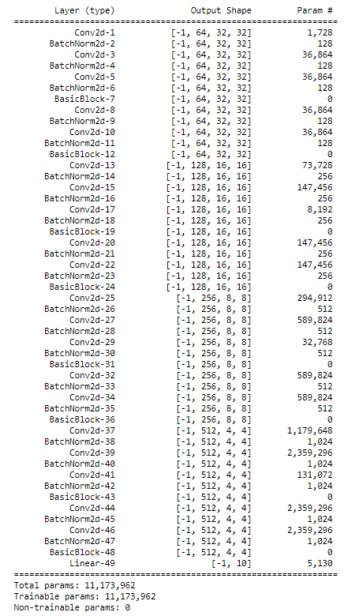
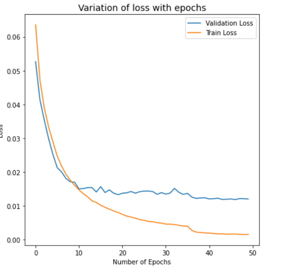
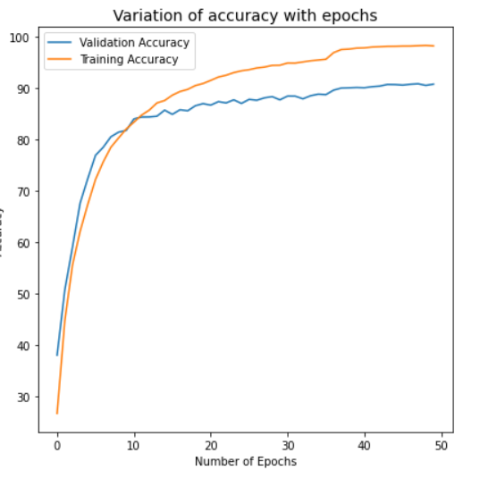
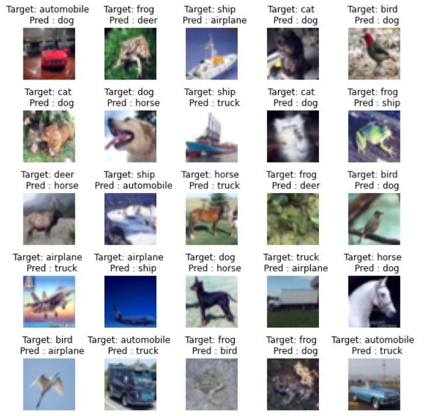

# Session 10 - Advanced Concepts in Training & Learning Rates

## Assignment Objective

* Pick Week9 code and add cutout
* Implement LR finder and ReduceLR on Plateau
* Implement GradCam function as a module
* Find Best LR and use SGD with momentum
* Train for 50 epochs
* Show training and test accuracy curves
* Target Accuracy is 88%
* Run Gradcam on 25 misclassified images and show ground truth and predictions for each

## Model Summary

The model reaches a final test accuracy of **90.79%** in **CIFAR-10** dataset in 50 epochs. Target accuracy is reached after 28 epochs.
The model has **11,173,962 parameters**.

## Model Parameters

## Hyperparameters

* Loss Function: Cross Entropy Loss
* Optimizer: SGD with momentum
* Learning Rate: 2.31E-01
* Scheduler: Reduce LR on Plateau with patience of 15
* Batch Size: 32
* Epochs: 50

## Transformations

* Rotate
* Horizontal Flip
* Cutout
  
## Variation of training and validation loss and accuracy with epochs

## Top Misclassified images

## Gradcam for some of the images in the validation set

