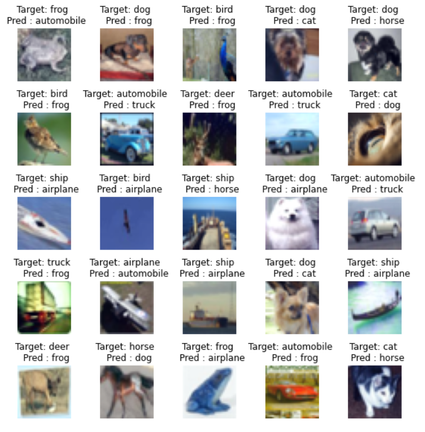

# Session 11 - Super Convergence

## Link to Classification Module repo

[https://github.com/anubhabPanda/Picasso](https://github.com/anubhabPanda/Picasso)

## Assignment Objective

* Write a code that draws Cyclic LR curve
* Write a code which uses the following ResNet Architecture for Cifar10
  
  * PrepLayer - Conv 3x3 s1, p1) >> BN >> RELU (64 kernels)
  * Layer1 :
    1. X = Conv 3x3 (s1, p1) >> MaxPool2D >> BN >> RELU (128 kernels)
    2. R1 = ResBlock( (Conv-BN-ReLU-Conv-BN-ReLU))(X) (128 kernels)
    3. Add(X, R1)
  * Layer 2 :
    1. Conv 3x3 (256 kernels)
    2. MaxPooling2D
    3. BN
    4. ReLU
  * Layer 3 :
    1. X = Conv 3x3 (s1, p1) >> MaxPool2D >> BN >> RELU (512 kernels)
    2. R2 = ResBlock( (Conv-BN-ReLU-Conv-BN-ReLU))(X) (512 kernels)
    3. Add(X, R2)
  * MaxPooling with Kernel Size 4
  * FC Layer
  * Softmax layer
* The code must use One Cycle Policy such that
  * Total Epochs = 24
  * Max at Epoch = 5
  * Find LR Max and LR Min
  * NO Annihilation
* Uses this transform -RandomCrop 32, 32 (after padding of 4) >> FlipLR >> Followed by CutOut(8, 8)
* Batch size = 512
* Target Accuracy = 90%

## Model Summary

The model reaches a final test accuracy of **90.02%** in **CIFAR-10** dataset in 24 epochs.
The model has **6,573,130 parameters**.

## Model Parameters

## Hyperparameters

* Loss Function: NLL Loss
* Optimizer: SGD with 0.9 momentum
* Max Learning Rate: 0.02
* Min Learning Rate: 0.002
* Scheduler: One Cycle LR
* Batch Size: 512
* Epochs: 24

## Transformations

* Padding 4 followed by 32X32 Random Crop
* Horizontal Flip
* 8X8 Cutout
  
## Variation of training and validation loss and accuracy with epochs

## Top Misclassified images

## Gradcam for some of the images in the validation set

