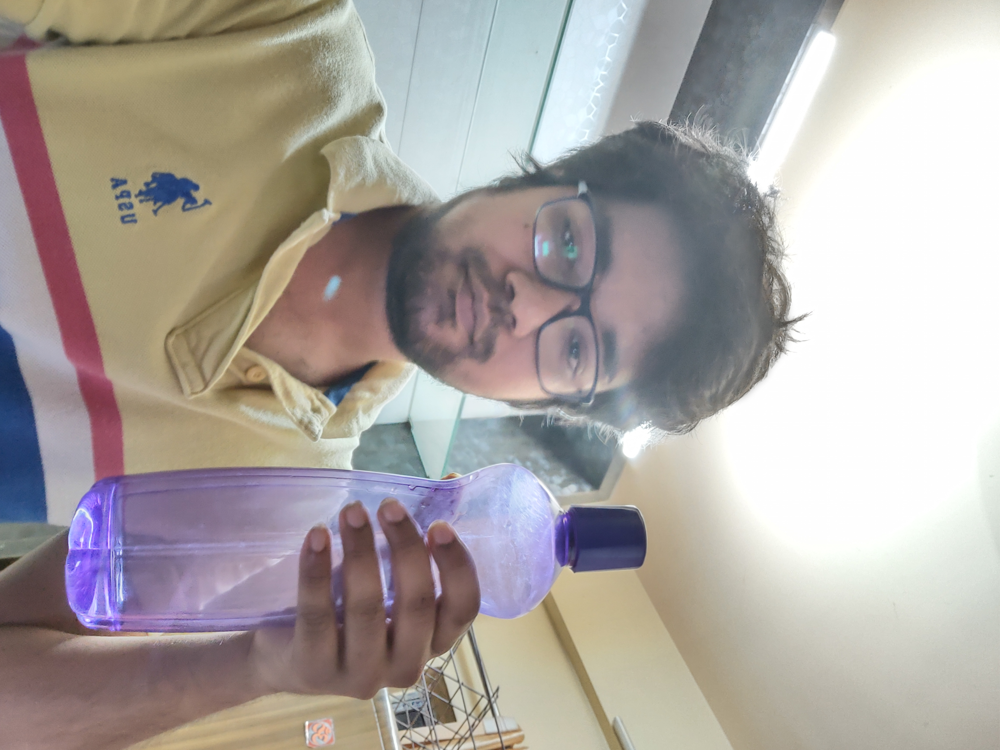
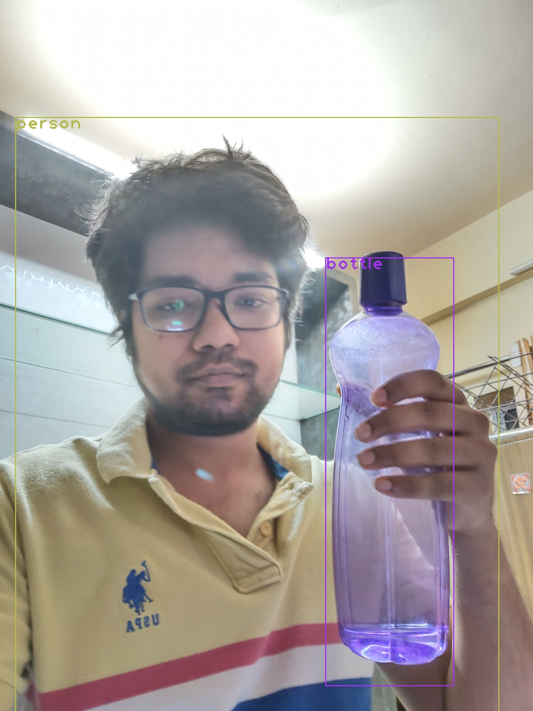
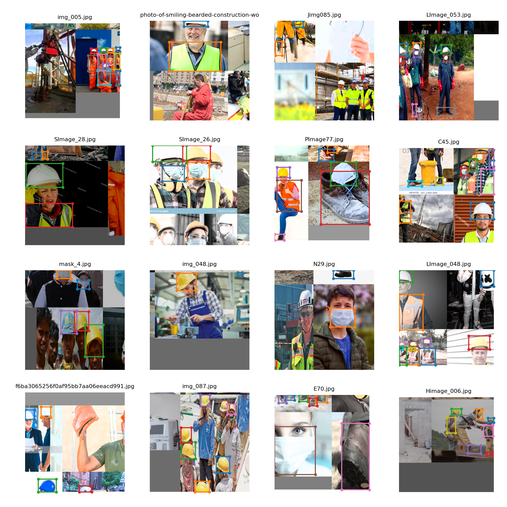
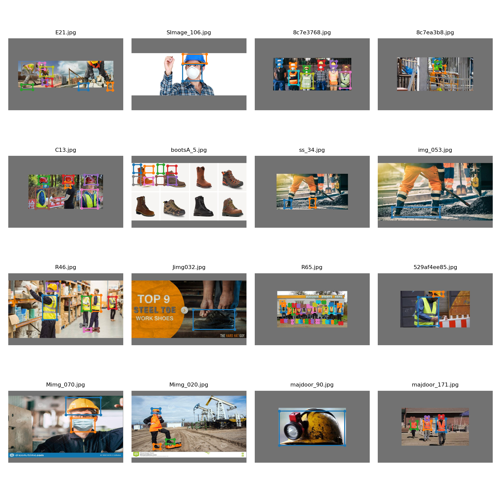
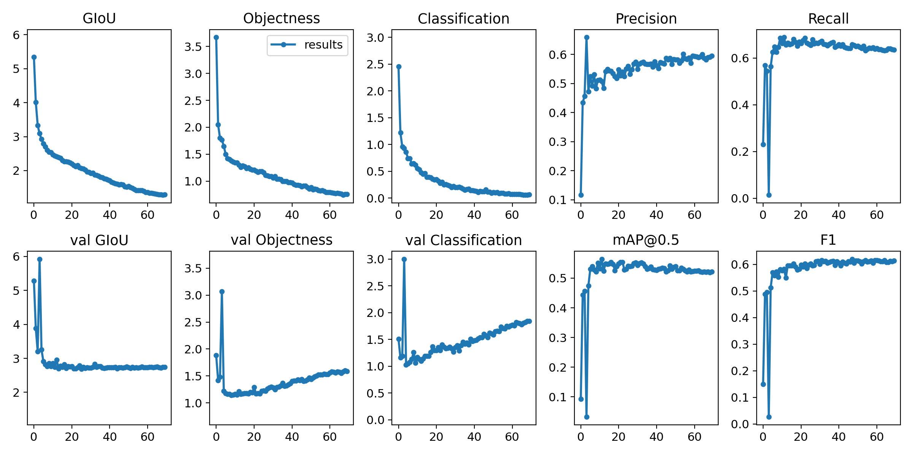
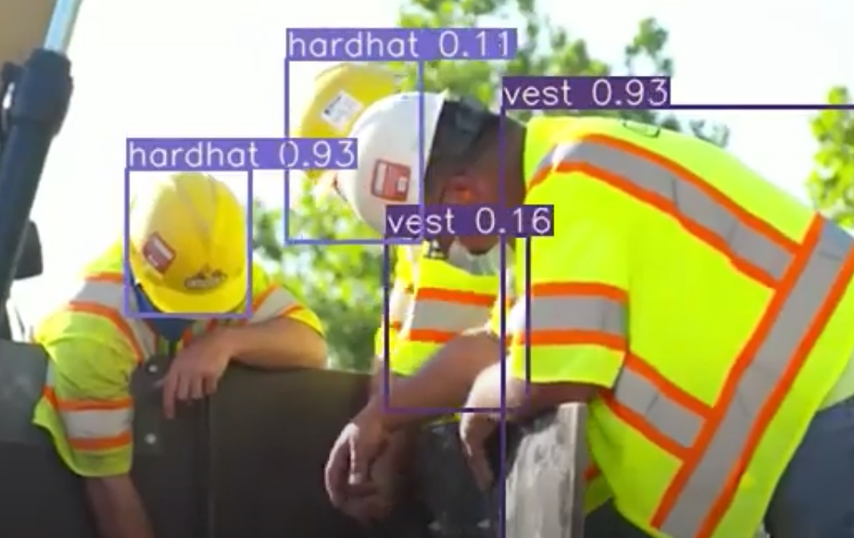

# Session 13 - Object Detection using Yolo

**Part A Notebook -**

**Part B Notebook -**

## Link to Object Detection Youtube Video

[https://youtu.be/A8Z-5xBn_ZM](https://youtu.be/A8Z-5xBn_ZM)

## Assignment Objective

### Part 1 (OpenCV Yolo)

1. Run the given code on own system [Source](https://pysource.com/2019/06/27/yolo-object-detection-using-opencv-with-python/)

2. Take an image of yourself, holding another object which is there in COCO data set (search for COCO classes to learn)

3. Run this image through the code above.

4. Share link to the implementation and the inferenced image.

### Part 2 (Dataset Annotation)

* Share the dataset annotated using [YoloV3 Annotation Tool](https://github.com/miki998/YoloV3_Annotation_Tool)

### Part 3 (Training Custom Dataset using YoloV3)
  
1. Train YoloV3 on the above self annotated dataset.

2. Download a very small video from Youtube which shows the classes.

3. Run inference on the video

4. Upload the video to Youtube

5. Share link to Github Project

6. Share link to Youtube Video

# Part A Solution

* Loaded the pretrained yolo weights to the OpenCV Yolo Model
* Did inference on own image having COCO Class

## Results

# Part B Solution

* Implemented YoloV3 code
* Trained the model on 4 classes 
  * Hardhat
  * Mask
  * Boots
  * Vest
* Ran inference on a Youtube Video
  
## Hyperparameters

* Batch Size: 20
* Epochs: 70
* Augmentation: RICAP
  
## Train and Test Batches

## Result

[Click here for the full Youtube Video](https://youtu.be/A8Z-5xBn_ZM)