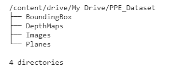

# Session 14 - Mask RCNN Dataset Preparation

**Depth Estmation Notebook -**

**Planercnn Notebook -**

## Link to PPE Dataset

[https://drive.google.com/drive/folders/1LFgBbTSbwX3W7DpqfnWn3WCJASVR_fh9?usp=sharing](https://drive.google.com/drive/folders/1LFgBbTSbwX3W7DpqfnWn3WCJASVR_fh9?usp=sharing)

## Assignment Objective

1. Take PPE dataset and run it through Midas and get depth images [Source](https://pysource.com/2019/06/27/yolo-object-detection-using-opencv-with-python/)

2. Take PPE dataset and run it through the PlanerCNN model and get planer images. [Source](https://github.com/NVlabs/planercnn/)

3. Upload to google drive with a shareable link for the entire dataset.

## About the dataset

The dataset contains 4 folder with each having different attributes for 4 classes. The classes are as follows :

* Hardhat
* Mask
* Boots
* Vest

The dataset has the following folders:

1. Images - The image folder contains images for above 4 classes. There are 3595 images.
2. Depth Maps - The depth maps folder contains Depth Maps generated from the MIDAS repo.
3. Bounding Box - This folder contains bounding box coordinates for all the images in the image folder.
4. Planes - This folder contains segmentation for different planes for each image in the image folder.
  