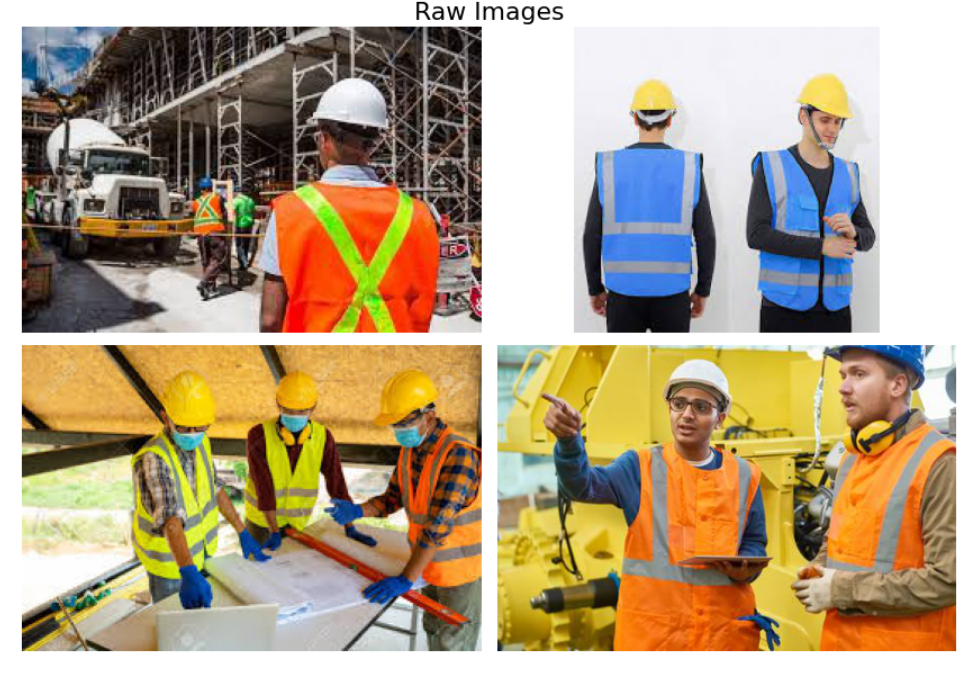
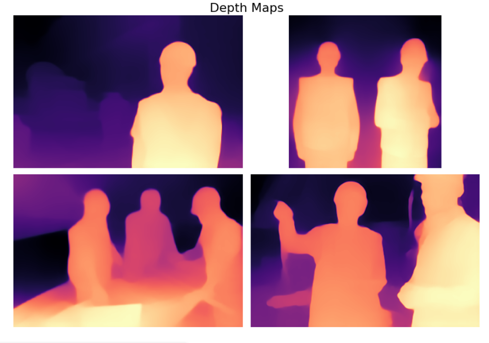
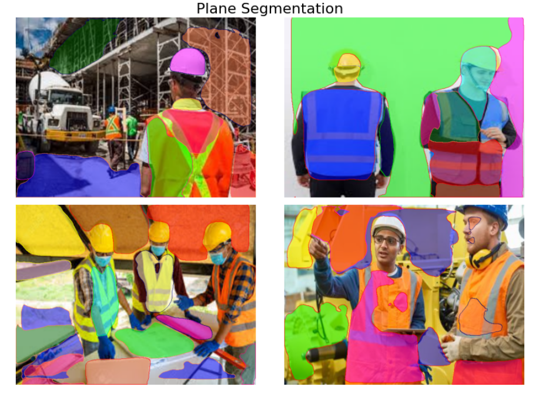
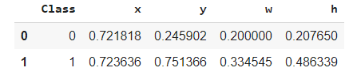

# Session 14 - Mask RCNN Dataset Preparation

**Depth Estmation Notebook -**

**Planercnn Notebook -**

## Link to PPE Dataset

[https://drive.google.com/drive/folders/1LFgBbTSbwX3W7DpqfnWn3WCJASVR_fh9?usp=sharing](https://drive.google.com/drive/folders/1LFgBbTSbwX3W7DpqfnWn3WCJASVR_fh9?usp=sharing)

## Assignment Objective

1. Take PPE dataset and run it through Midas and get depth images [Source](https://github.com/intel-isl/MiDaS)

2. Take PPE dataset and run it through the PlanerCNN model and get planer images. [Source](https://github.com/NVlabs/planercnn/)

3. Upload to google drive with a shareable link for the entire dataset.

## About the dataset

The dataset contains 4 folder with each having different attributes for 4 classes. The classes are as follows :

* Hardhat
* Mask
* Boots
* Vest

The dataset has the following folders:

1. Images - The image folder contains images for above 4 classes. There are 3595 images. Each image is in jpg format.

2. Depth Maps - The depth maps folder contains Depth Maps generated from the MIDAS repo. Each image is in png format.

3. Planes - This folder contains segmentation for different planes for each image in the image folder. Each image is in png format.

4. Bounding Box - This folder contains bounding box coordinates for all the images in the image folder. It contains .txt file with each file 5 values for different classes present in the corresponding image file. The 5 values are: 
   * class: Which class the bounding box belongs to.
   * x : X-Coordinate of upper left corner of the bounding box
   * y: Y-Coordinate of the upper left corner of the bounding box
   * w: Width of the bounding box 
   * h: height of the bounding box

      

    The image above shows the contents of one such .txt file  having 2 classes (hardhat and mask)

## How the dataset was created?

1. Raw Images - For the raw images, Bing Image Search API was used to generate images corresponding to various search terms such as - 
   * hardhat, mask, boots, vest
   * construction worker wearing PPE
   * PPE in construction site, etc
  
2. Bounding Box - For generating the bounding box, each raw image was manually annotated using the following tool:
   * [YoloV3 Annotation Tool](https://github.com/miki998/YoloV3_Annotation_Tool)
   * This generates .txt files for each image containing the class and bounding box coordinates for each class

3. Depth Maps - For generating the depth maps, inference was run on the raw images using the following library:
   * [Towards Robust Monocular Depth Estimation: Mixing Datasets for Zero-shot Cross-dataset Transfer](https://github.com/intel-isl/MiDaS)
   * This generates depth maps for each image in .png format
4. Planar Segmentation - For generating the planar surface segmentations , inference was run on the raw images using the following library:
   * [PlaneRCNN: 3D Plane Detection and Reconstruction from a Single Image](https://github.com/NVlabs/planercnn/) 
  