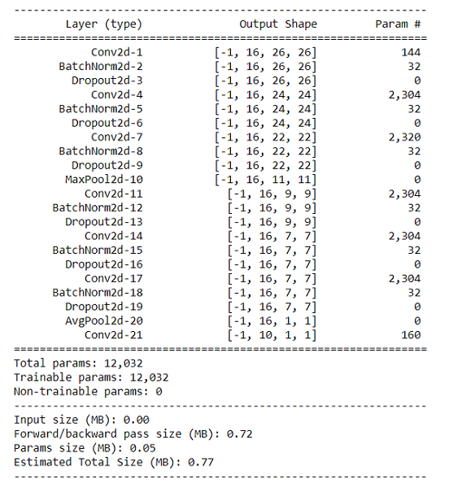

# Week 4- Architectural Basics

## Assignment Objective

The goal of this assignment is to achieve **>99.40%** accuracy on the test set of the **MNIST handwritten dataset**. The model needs to have the following constraints :

* Less than 20K Parameters
* Less than 20 epochs
* No fully connected layers

## Network Architecture

## Approach

* Performed three 3X3 convolutions with 16 channels before maxpooling to achieve a receptive field of 7 since for images of size 28X28, edges and gradients are at a minimum size of 7 pixels.
* After maxpooling performed three more 3X3 convolution with 16 channels to reach 7X7 image size and receptive field of 22.
* Used Batchnorm and Dropout of 10% after every convolutional block except the last block.
* Used Global Average Pooling at 7X7 to convert to 1X1.
* Performed 1X1 convolution to reduce the number of channels to 10.
* Used softmax activation function at the end to get the likelihood for each class.
* **Loss Function**: Negative Log Likelihood
* **Optimizer**: Stochastic Gradient Descent with momentum of 0.1.

## Network Parameters

Total number of parameters in the network is 12,032.

## Hyperparameters

* **Learning Rate :** 0.01
* **Batch Size :** 32
* **Dropout :** 0.1

## Results

Achieved accuracy of **99.40%** at 16th epoch and reached an accuracy of **99.42%** at 19th epoch.
