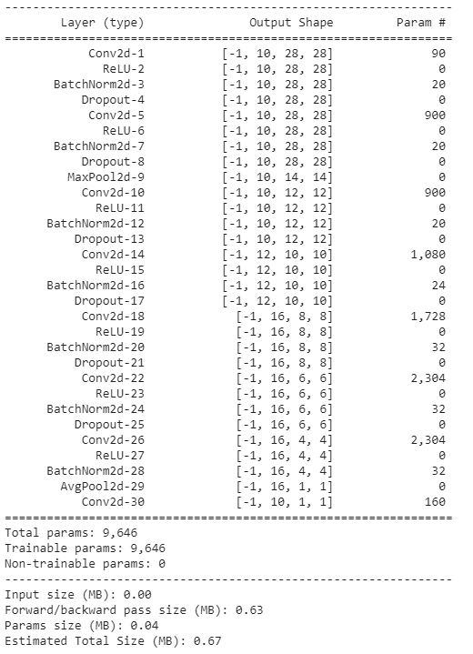
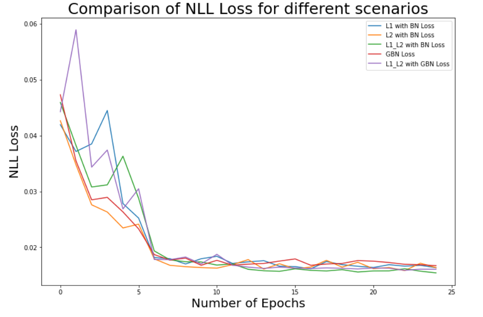
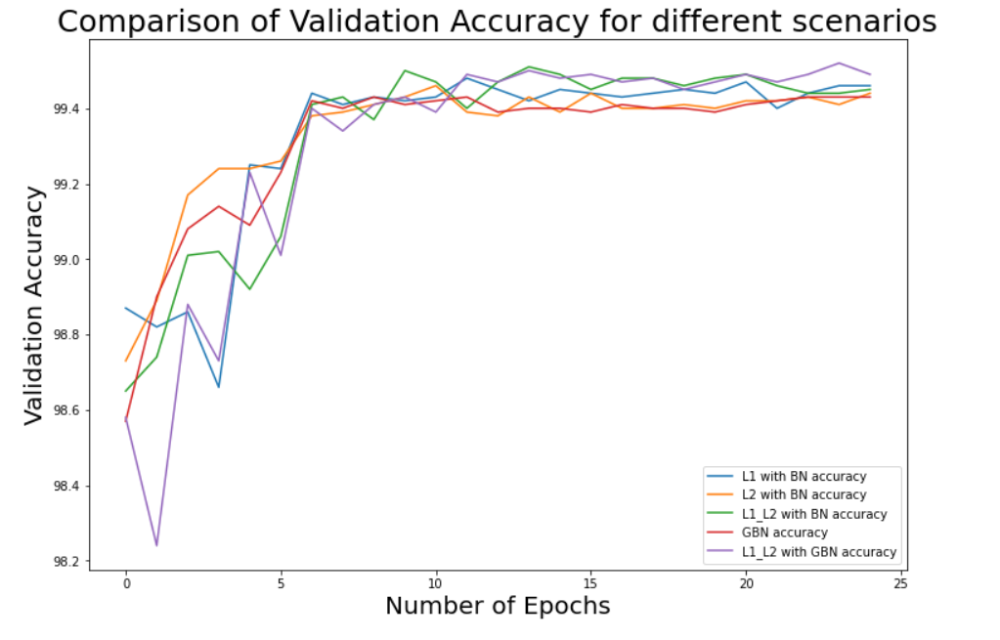
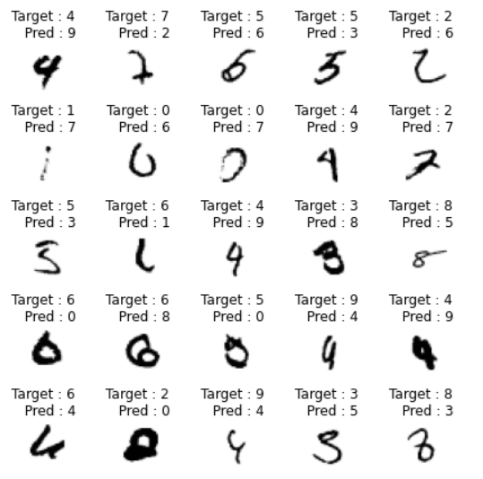

# Session 6 - Batch Normalization and Regularization

## Assignment Objective

1. The goal of this assignment is to take the best code from the previous assignment, run for 25 epochs and report findings for the following:

    * with L1 + Batch Norm
    * with L2 + Batch Norm
    * with L1 and L2 with Batch Norm
    * with Ghost Batch Norm
    * with L1 and L2 with Ghost Batch Norm
2. Write a single loop or iterator to iterate through these conditions
3. Draw 2 graphs with proper legends showing the following:
    * Validation accuracy curve for all 5 jobs above
    * Loss curves for all 5 jobs above
4. Find any 25 misclassified images (combined into single plot) for the GBN model. Must use the saved model from the above jobs. Must show actual and predicted class names.

## Model Parameters

## Model Hyperparameters

* Dropout: 0.04
* Batch size: 64
* Learning Rate: 0.01
* L1 parameter: 0.0002
* L2 parameter: 0.0001
* Ghost Batch Norm Splits: 4

## Results

### Validation Accuracy and Loss Curves

The loss for various scenarios are plotted below:

The accuracy for various scenarios are plotted below:

### Misclassified images

The misclassified images for the model with Ghost Batch Normalization are shown below:

