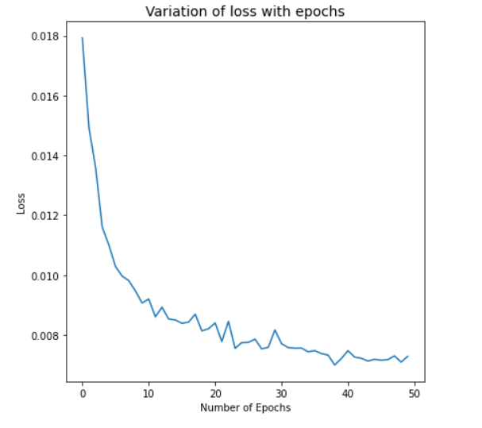
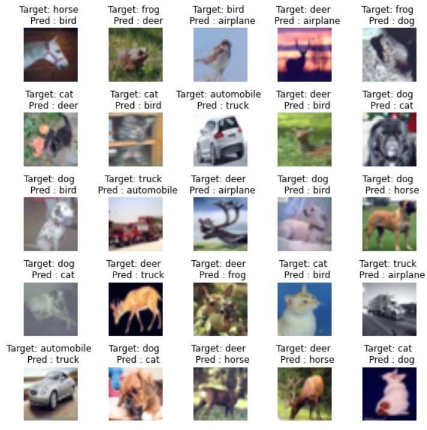

# Session 7 - Advanced Convolutions

## Assignment Objective

* Change the code such that it uses GPU
* Change the architecture to C1C2C3C40 (basically 3 MPs)
* Total RF must be more than 44
* One of the layers must use Depthwise Separable Convolution
* One of the layers must use Dilated Convolution
* Use GAP (compulsory):- add FC after GAP to target #of classes (optional)
* Achieve 80% accuracy, as many epochs as you want. Total number of parameterss to be less than 1M.

## Model Summary

The model reaches a test accuracy of **84.83%** in **CIFAR-10** dataset. The model uses the following types of convolutions:

* 3x3 Convolution
* Pointwise Convolution
* Atrous Convolution
* Depthwise Separable Convolution
* Max Pooling

The model has **94,218 parameters**.

## Model Parameters

## Hyperparameters

* Loss Function: Cross Entropy Loss
* Optimizer: SGD
* Learning Rate: 0.01
* Dropout Rate: 0.1
* Batch Size: 64
* Epochs: 50

## Change in Validation Loss and Accuracy

## Top Misclassified images
