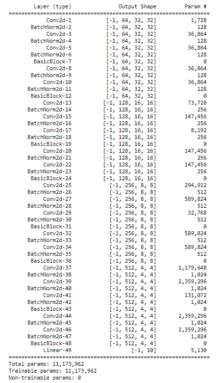
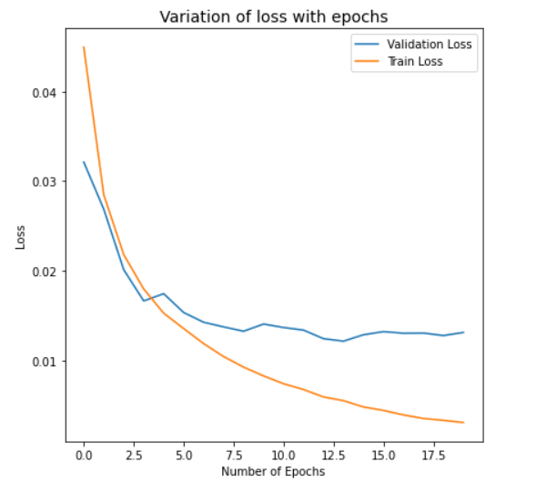
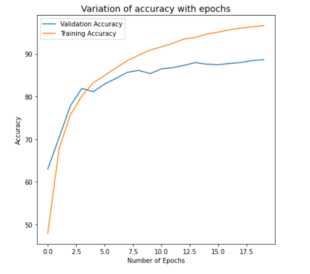
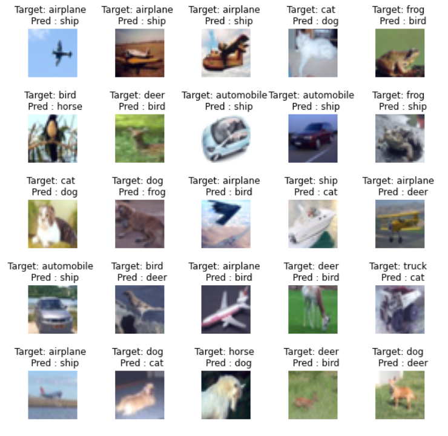

# Session 8 - Receptive Fields and Network Architectures

## Assignment Objective

* Extract Resnet18 model from pytorch-cifar repo
* Train Resnet18 on CIFAR10 dataset
* Achieve 85% target accuracy
* Use any number of epochs

## Model Summary

The model reaches a test accuracy of **88.65%** in **CIFAR-10** dataset in 20 epochs.
The model has **11,173,962 parameters**.

## Model Parameters

## Hyperparameters

* Loss Function: Cross Entropy Loss
* Optimizer: SGD
* Learning Rate: 0.01
* Dropout Rate: 0.1
* Batch Size: 32
* Epochs: 20
* LR Scheduler: Step LR with step size of 5 and gamma of 0.1

## Variation of training and validation loss and accuracy with epochs

## Top Misclassified images
