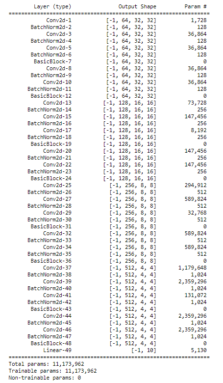

# Session 9 - Data Augmentations

## Assignment Objective

* Move Week8's code transformations to Albumentations. Apply ToTensor, HorizontalFlip, Normalize (at min) + More (for additional points)
* Please make sure that your test_transforms are simple and only using ToTensor and Normalize
* Implement GradCam function as a module.
* Final code (notebook file) must use imported functions to implement transformations and GradCam functionality
* Target Accuracy is 87%

## Model Summary

The model reaches a final test accuracy of **88.39%** in **CIFAR-10** dataset in 20 epochs.
The model has **11,173,962 parameters**.

## Model Parameters

## Hyperparameters

* Loss Function: Cross Entropy Loss
* Optimizer: SGD
* Learning Rate: 0.01
* Batch Size: 32
* Epochs: 20
* LR Scheduler: Step LR with step size of 6 and gamma of 0.1

## Transformations
* Rotate
* Horizontal Flip
* Cutout
  
## Variation of training and validation loss and accuracy with epochs

## Top Misclassified images

## Gradcam for some of the images in the validation set

